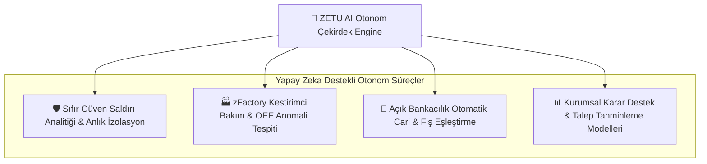

# ZETU Teknoloji - Kurumsal Dijital Ekosistem & Otonom Mühendislik

<div align="center">

[](https://zetuteknoloji.com)
[](https://linkedin.com/company/zetuteknoloji)
[](https://twitter.com/zetuteknoloji)
[](https://github.com/zetuteknoloji)
[](mailto:arge@zetuteknoloji.com)

<br />

<p align="center">
  <strong>Yapay Zeka Destekli Kurumsal Evrim & Tümleşik Sektörel Çözüm Mimarisi</strong><br />
  Geleneksel BT yapılarını; kendi kendini yöneten otonom bulut omurgası, Sıfır Güven (Zero-Trust) siber kalkanı, VUK-507 akıllı ödeme teknolojileri ve zFactory endüstriyel IoT ekosistemine dönüştürüyoruz.
</p>

[🌐 Web Sitesi](https://zetuteknoloji.com) • [🚀 Kurumsal Evrimimiz](#-kurumsal-evrim-legacyden-otonom-ekosisteme) • [🤖 Yapay Zeka Çekirdeği](#-yapay-zeka-ai-destekli-otonom-omurga) • [🏭 Sektörel Çözümler](#-tümleşik-sektörel-bakış-yapısı) • [💻 Proje Sayfaları](#-proje-ve-çözüm-sayfalarımız) • [📬 İletişim](#-sosyal-medya--resmi-kanallarımız)

</div>

---

## 🧬 Kurumsal Evrim: Legacy'den Otonom Ekosisteme

Modern iş dünyasında geleneksel BT operasyonları —yani sorun çıktığında müdahale eden reaktif modeller, izole çalışan yazılımlar ve hantal donanım yapıları— artık rekabet avantajı sağlamıyor. **ZETU Teknoloji**, bu darboğazı kırarak köklü bir **Kurumsal Evrim** gerçekleştirdi:

```
[Geleneksel BT: Reaktif, Parçalı, Manuel]
                  ⬇️  (ZETU KURUMSAL EVRİM SÜRECİ)
[Geleceğin BT'si: Otonom, Kestirimci, Yapay Zeka ile Tümleşik ve Regülasyonlara Tam Uyumlu]
```

* **Reaktif Sorun Çözümünden ➡️ Kestirimci Otonom Mühendisliğe:** Arızaların oluşmasını beklemek yerine; IoT telemetrisi ve yapay zeka ajanlarıyla riskleri saniyeler öncesinden tespit edip izole eden akıllı omurga.
* **İzole Yazılımlardan ➡️ Tek Ekosistem Bütünlüğüne:** ERP, bankacılık boru hatları, saha POS cihazları ve bulut yedeklemelerinin tek bir merkezi topolojide senkronize çalışması.
* **Metin Yığınlarından ➡️ Görsel & Deneyimsel Şeffaflığa:** "İnsanlar okumuyor, hap bilgi istiyor" felsefesiyle tüm çözümlerimizi canlı simülatörler, etkileşimli donanım vitrinleri ve gerçek zamanlı telemetri panelleriyle somutlaştırdık.

---

## 🤖 Yapay Zeka (AI) Destekli Otonom Omurga

ZETU Teknoloji'nin kurumsal evriminin merkezinde, operasyonel yükü insan faktöründen alıp algoritmik güce devreden **Tümleşik Yapay Zeka Çekirdeği** yer alır:



1. **Siber Savunmada Otonom Müdahale (AI-Powered SOC):** Geleneksel güvenlik duvarlarının ötesinde; şüpheli davranış kalıplarını, fidye yazılımlarını ve kimlik ihlallerini insan müdahalesine gerek kalmadan mikrosaniyeler içinde izole eder.
2. **Endüstriyel IoT'de Kestirimci Zeka:** zFactory sensör verilerini (titreşim, sıcaklık, basınç) işleyen yapay zeka modelleri, CNC frezelerin veya pres hatlarının arıza yapacağı anı öngörerek duruş maliyetlerini sıfıra indirir.
3. **Açık Bankacılıkta Doğal Dil & Fiş Eşleme:** 25+ bankadan akan heterojen işlem açıklamalarını NLP algoritmalarıyla analiz ederek doğru muhasebe ve ERP hesaplarına otomatik işler.

---

## 🏭 Tümleşik Sektörel Bakış Yapısı

Teknolojiyi soyut bir kavram olarak değil, doğrudan **sektörlerin reel ihtiyaçlarına yanıt veren entegre bir mimari** olarak ele alıyoruz:

| Sektör | Karşılaşılan Darboğaz | ZETU Tümleşik Çözümü & Değeri |
| :--- | :--- | :--- |
| **🏭 Sanayi & İleri İmalat** | Beklenmeyen makine duruşları, manuel OEE takibi | **[zFactory Akıllı Üretim](https://zetuteknoloji.com/tr/cozumlerimiz/akilli-uretim-yonetimi-zfactory):** Canlı telemetri, kestirimci bakım alarmları ve ERP entegre üretim takibi. |
| **🛍️ Perakende & Mağazacılık** | GİB VUK-507 zorunlulukları, kuyruklar, çoklu POS maliyeti | **[VUK-507 Akıllı POS](https://zetuteknoloji.com/tr/cozumlerimiz/vuk-507):** Pavo Android POS, insansız kiosk modülleri ve anında e-fatura/e-arşiv entegrasyonu. |
| **🏦 Finans & FinTech** | Çoklu banka hesaplarının takibinde manuel hata ve zaman kaybı | **[Açık Bankacılık](https://zetuteknoloji.com/tr/cozumlerimiz/banka-hesap-hareketleri):** Tüm banka hesaplarının tek ekranda toplanıp ERP'ye otomatik aktığı canlı veri boru hattı. |
| **🚚 Lojistik & Dağıtım** | Saha iletişim kopuklukları, veri kaybı | **[Otonom Bulut & SD-WAN](https://zetuteknoloji.com/tr/cozumlerimiz/otonom-is-surekliligi-bulut):** 7/24 kesintisiz saha bağlantısı, RPO < 15 dk veri sürekliliği. |
| **🏥 Sağlık & Özel Kurumlar** | Hassas veri güvenliği, KVKK regülasyonları | **[Sıfır Güven Siber Savunma](https://zetuteknoloji.com/tr/cozumlerimiz/sifir-guven-siber-savunma-soc):** Uçtan uca şifreleme, EDR/SIEM ve yerli veri merkezinde barındırma. |
| **🏢 Kurumsal Şirketler** | Yüksek Microsoft/Google lisans giderleri, veri egemenliği | **[ZETU Kurumsal Mail](https://zetuteknoloji.com/tr/cozumlerimiz/kurumsal-mail):** %70 maliyet avantajı, kesintisiz veri göçü ve %100 yerli bulut altyapısı. |

---

## 💻 Proje ve Çözüm Sayfalarımız

ZETU Teknoloji ekosisteminin tüm canlı platform modüllerine ve interaktif deneyim sayfalarına doğrudan erişebilirsiniz:

### 🛡️ Temel Çözüm ve Simülasyon Sayfaları
* 🌐 **[Resmi Web Platformu](https://zetuteknoloji.com)**: ZETU Teknoloji kurumsal ana kapısı ve fütüristik yörünge (orbital) ekosistem vitrini.
* 🛡️ **[Sıfır Güven Siber Savunma (SOC)](https://zetuteknoloji.com/tr/cozumlerimiz/sifir-guven-siber-savunma-soc)**: Canlı Siber Savunma Simülatörü, fidye yazılımı ve sızıntı izolasyon demosu.
* 💳 **[VUK-507 Yeni Nesil Ödeme Sistemleri](https://zetuteknoloji.com/tr/cozumlerimiz/vuk-507)**: Pavo Android POS, UN20 İnsansız Kiosk Modülü ve donanım vitrini.
* 🏦 **[Açık Bankacılık & Hesap Hareketleri Entegrasyonu](https://zetuteknoloji.com/tr/cozumlerimiz/banka-hesap-hareketleri)**: 25+ bankanın canlı veri boru hattı ve ERP muhasebeleştirme motoru.
* 🏭 **[zFactory Akıllı Üretim Yönetimi (IoT)](https://zetuteknoloji.com/tr/cozumlerimiz/akilli-uretim-yonetimi-zfactory)**: Canlı fabrika zemin telemetrisi, titreşim/sıcaklık sensörleri ve OEE panosu.
* 📧 **[Kurumsal E-Posta & Kesintisiz Geçiş](https://zetuteknoloji.com/tr/cozumlerimiz/kurumsal-mail)**: Canlı TCO Maliyet Hesaplayıcı Modal ve lisans tasarruf simülasyonu.
* ☁️ **[Otonom İş Sürekliliği & Hibrit Bulut](https://zetuteknoloji.com/tr/cozumlerimiz/otonom-is-surekliligi-bulut)**: RPO/RTO metrikleri, felaket kurtarma ve replikasyon altyapısı.
* 🌐 **[NOC Proaktif Ağ ve Sistem Yönetimi](https://zetuteknoloji.com/tr/cozumlerimiz/proaktif-ag-ve-sistem-yonetimi-noc)**: 7/24 ağ gözlem merkezi ve bant genişliği optimizasyonu.
* 🤖 **[Yapay Zeka Destekli İş Zekası (BI)](https://zetuteknoloji.com/tr/cozumlerimiz/yapay-zeka-destekli-is-zekasi-bi)**: Tahminleme modelleri ve yönetici karar destek dashboard'ları.
* 🔄 **[ERP, CRM ve İş Akışı Entegrasyonları](https://zetuteknoloji.com/tr/cozumlerimiz/erp-crm-ve-is-akisi-entegrasyonlari)**: SAP, Logo, Mikro ve Netsis çift yönlü veri köprüsü.
* 🩺 **[Dijital Röntgen ve Kurumsal Mimari Analizi](https://zetuteknoloji.com/tr/cozumlerimiz/dijital-rontgen-ve-kurumsal-mimari)**: BT altyapı röntgeni, güvenlik açığı ve verimlilik taraması.
* 👔 **[Stratejik BT Dış Kaynak Yönetimi (vCIO)](https://zetuteknoloji.com/tr/cozumlerimiz/stratejik-bt-dis-kaynak-yonetimi-vcio)**: Üst düzey teknoloji danışmanlığı ve bütçe planlaması.
* 📦 **[Donanım ve Tedarik Ekosistemi](https://zetuteknoloji.com/tr/cozumlerimiz/donanim-ve-tedarik-ekosistemi)**: Kurumsal sunucu, firewall ve ağ cihazları tedarik altyapısı.

### 🎯 İnteraktif Araçlar ve Bilgi Merkezleri
* 🏆 **[Başarı Hikayeleri & Vaka Çalışmaları](https://zetuteknoloji.com/tr/basari-hikayeleri)**: Sanayi, perakende ve finans sektörlerinde ROI odaklı dönüşüm panosu.
* 🔍 **[Canlı Siber Güvenlik Skorlama Aracı](https://zetuteknoloji.com/tr/siber-farkindalik)**: Kurumunuzun siber güvenlik dayanıklılığını anında test eden 5 adımlı ölçüm aracı.
* 🧩 **[Tümleşik Sektörel Paketler](https://zetuteknoloji.com/tr/sektorel-cozumler)**: Üretim, perakende, lojistik ve sağlık için hazır mimari paketler.
* 📝 **[Teknoloji & Mühendislik Blogu](https://zetuteknoloji.com/tr/blog)**: Otonom sistemler, VUK-507 mevzuatı ve siber güvenlik makaleleri.
* 🤝 **[Global Teknoloji Ortaklarımız](https://zetuteknoloji.com/tr/partners)**: Ekosistemimizi güçlendiren global donanım ve yazılım üreticileri.

---

## 🛠️ GitHub Ekosistemimiz & Kod Depoları

* **[`zetuteknoloji/zetuteknoloji.com`](https://github.com/zetuteknoloji/zetuteknoloji.com)**: Platformun tüm kaynak kodları (Next.js 16 Turbopack, Tailwind CSS v4, Framer Motion, Laravel 11 API, 5 canlı simülatör, çok dilli TR/EN/AM sözlükleri ve kapsamlı teknik dokümantasyon).
* **[`zetuteknoloji/.github`](https://github.com/zetuteknoloji/.github)**: Organizasyon profili, kurumsal standartlar ve topluluk yapılandırmaları.

---

## 📬 Sosyal Medya & Resmi Kanallarımız

Gelişmelerimizi takip etmek, yeni nesil teknolojiler hakkında bilgi almak ve projeleriniz için doğrudan bizimle iletişime geçmek için:

* 🌐 **Resmi Web Sitesi:** [zetuteknoloji.com](https://zetuteknoloji.com)
* 💼 **LinkedIn:** [linkedin.com/company/zetuteknoloji](https://linkedin.com/company/zetuteknoloji)
* 🐦 **X (Twitter):** [twitter.com/zetuteknoloji](https://twitter.com/zetuteknoloji)
* 🐙 **GitHub:** [github.com/zetuteknoloji](https://github.com/zetuteknoloji)
* ✉️ **Ar-Ge & Mühendislik:** [arge@zetuteknoloji.com](mailto:arge@zetuteknoloji.com)
* 📞 **Kurumsal İletişim:** [iletisim@zetuteknoloji.com](mailto:iletisim@zetuteknoloji.com)
* 📍 **Genel Merkez:** İstanbul, Türkiye

---

<div align="center">
  <sub>© 2026 ZETU Teknoloji A.Ş. • Yapay Zeka Destekli Otonom Mühendislik</sub>
</div>
