# ZETU Teknoloji - Kurumsal Dijital Ekosistem & Otonom Mühendislik

<div align="center">

[](https://zetuteknoloji.com)
[](https://linkedin.com/company/zetuteknoloji)
[](https://twitter.com/zetuteknoloji)
[](mailto:arge@zetuteknoloji.com)

<br />

<p align="center">
  <strong>Geleceğin kurumsal teknolojilerini bugünden inşa ediyoruz.</strong><br />
  Uçtan uca otonom bulut altyapısı, Sıfır Güven (Zero-Trust) siber savunma, VUK-507 yeni nesil ödeme teknolojileri, açık bankacılık veri boru hatları ve zFactory endüstriyel IoT ekosistemi.
</p>

[🌐 Web Sitesi](https://zetuteknoloji.com) • [💻 Çözümlerimiz](https://zetuteknoloji.com/tr/cozumlerimiz) • [🛡️ Siber Savunma (SOC)](https://zetuteknoloji.com/tr/cozumlerimiz/sifir-guven-siber-savunma-soc) • [💳 VUK-507 POS](https://zetuteknoloji.com/tr/cozumlerimiz/vuk-507) • [📬 İletişim](https://zetuteknoloji.com/tr/iletisim)

</div>

---

## 🌟 Biz Kimiz? (About Us)

**ZETU Teknoloji**, geleneksel ve hantal bilgi teknolojileri kalıplarını yıkarak; kurumlara kendi kendini onaran, regülasyonlara %100 tam uyumlu, siber saldırılara karşı sıfır güven mimarisiyle korunan otonom dijital sistemler üreten bir teknoloji ve mühendislik şirketidir.

Mühendislik felsefemiz **"Görsel Öncelikli Yaklaşım ve Kesintisiz Süreklilik"** üzerine kuruludur. Karmaşık kurumsal süreçleri sadeleştirir, canlı simülasyonlar ve telemetri panelleriyle ölçülebilir ve şeffaf hale getiririz.

---

## 🏛️ ZETU Otonom Ekosistem Mimarisi

```mermaid
graph LR
    subgraph EdgeDevices ["1. Saha & Donanım Katmanı (Edge)"]
        POS["VUK-507 Akıllı POS & Kiosk"]
        IoT["zFactory Sensör & PLC/CNC"]
        Branch["Şube & Ağ Cihazları (SD-WAN)"]
    end

    subgraph AutonomousCore ["2. ZETU Otonom Çekirdek (Core Engine)"]
        SOC["Sıfır Güven SOC & EDR"]
        Gateway["Açık Bankacılık API Köprüsü"]
        NOC["7/24 Proaktif Ağ İzleme (NOC)"]
    end

    subgraph EnterpriseCloud ["3. Kurumsal Bulut & ERP Katmanı"]
        ERP["ERP / CRM Entegrasyonları (SAP, Logo)"]
        Cloud["Otonom Bulut & Felaket Kurtarma"]
        Mail["ZETU Kurumsal E-Posta"]
    end

    EdgeDevices -->|Şifreli Canlı Telemetri| AutonomousCore
    AutonomousCore -->|Doğrulanmış Otonom Akış| EnterpriseCloud
```



---

## 🚀 Temel Mühendislik & Çözüm Alanlarımız

| Çözüm Alanı | Canlı Deneyim & Açıklama |
| :--- | :--- |
| **🛡️ Sıfır Güven Siber Savunma (SOC)** | Tehdit avcılığı, EDR/XDR, SIEM analitiği ve tarayıcı tabanlı **Canlı SOC Siber Saldırı Simülatörü** ile fidye yazılımlarını milisaniyeler içinde izole eden siber kalkan. |
| **💳 VUK-507 Yeni Nesil Ödeme Sistemleri** | GİB lisanslı Pavo Android POS, insansız kiosk modülleri ve masaüstü cihazlar için ERP entegre güvenli tahsilat vitrini. |
| **🏦 Açık Bankacılık (Open Banking)** | 25+ bankanın hesap hareketlerini tek merkezde toplayan, yapay zeka destekli **Canlı Veri Boru Hattı** ile otomatik muhasebe fişi eşleştirme. |
| **🏭 zFactory Akıllı Üretim (IoT)** | Fabrika zemininden CNC/PLC telemetrisi, OEE verimlilik hesaplama, kestirimci bakım alarmları ve **Canlı Fabrika Telemetri Paneli**. |
| **📧 Kurumsal E-Posta & Veri Göçü** | %100 yerli veri merkezi, Microsoft 365 ve Google Workspace'e göre %70'e varan TCO maliyet avantajı ve kesintisiz geçiş altyapısı. |
| **☁️ Otonom İş Sürekliliği & Hibrit Bulut** | RPO < 15 dakika, RTO < 1 saat felaket kurtarma (Disaster Recovery) ve çift yönlü bulut yedekleme omurgası. |
| **🌐 Proaktif Ağ & Sistem (NOC)** | 7/24 kesintisiz ağ izleme, bant genişliği optimizasyonu ve proaktif darboğaz engelleme servisi. |
| **🤖 Yapay Zeka & İş Zekası (BI)** | Dağınık verileri anlamlandıran makine öğrenimi modelleri, otomatik talep tahminleme ve karar destek dashboard'ları. |

---

## 🛠️ Teknoloji & Mühendislik Standartlarımız

```
Frontend    :: Next.js 16 (App Router, Turbopack) • Tailwind CSS v4 • Framer Motion • TypeScript
Backend     :: Laravel 11 • PHP 8.2+ • RESTful APIs • Filament Admin
Databases   :: PostgreSQL • SQLite • Redis Önbellek • Meilisearch
DevOps      :: Docker • Docker Compose • Nginx Reverse Proxy • Zero-Downtime Rsync CI/CD
Design      :: Fütüristik Gece (Dark) & Gündüz (Light) Modu Eşitliği • Hap Bilgi (Bite-Sized) UI
```

---

## 📦 Öne Çıkan Depolarımız (Repositories)

- **[`zetuteknoloji.com`](https://github.com/zetuteknoloji/zetuteknoloji.com)**: ZETU Teknoloji kurumsal dijital platformunun tüm kaynak kodları, 5 canlı simülasyonu, çok dilli yapısı (TR/EN/AM) ve kapsamlı mimari dokümantasyonu.
- **[`.github`](https://github.com/zetuteknoloji/.github)**: Organizasyon profili, genel topluluk ve marka kimliği standartları.

---

## 🌍 Çok Dilli Küresel Vizyon
Platformlarımız 3 dili yerel olarak destekler:
* 🇹🇷 **Türkçe:** Türkiye pazarındaki regülasyonlar (GİB VUK-507, KVKK) ve ERP standartları.
* 🇬🇧 **İngilizce:** Global teknoloji ortaklıkları ve uluslararası operasyonlar.
* 🇪🇹 **Amharca:** Doğu Afrika ve yükselen pazarlar için özel yerelleştirme.

---

## 📬 İletişim ve İş Birliği

İşletmenizin dijital altyapısını güçlendirmek, regülasyonlara uyumlu yeni nesil ödeme sistemlerine geçmek veya Ar-Ge projelerimizde ortaklık kurmak için:

- 🏢 **Genel Merkez:** İstanbul, Türkiye
- 🌐 **Web:** [zetuteknoloji.com](https://zetuteknoloji.com)
- ✉️ **Ar-Ge & Mühendislik:** [arge@zetuteknoloji.com](mailto:arge@zetuteknoloji.com)
- 📞 **Kurumsal İletişim:** [iletisim@zetuteknoloji.com](mailto:iletisim@zetuteknoloji.com)

---

<div align="center">
  <sub>© 2026 ZETU Teknoloji A.Ş. • Geleceğin Otonom Teknolojileri</sub>
</div>
